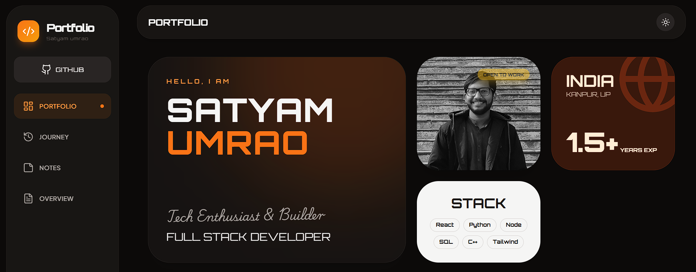

# 🌐 Satyam Umrao — [Portfolio Website](https://www.satyamumrao.in)

---

## 👋 About Me

Hi, I’m **Satyam Umrao**, a passionate Frontend Developer and BCA student who loves building **clean, modern, and high-performance web applications**.

I specialize in **React-based interfaces**, responsive UI design, and writing scalable, maintainable frontend code. My portfolio showcases real-world projects, clean UI/UX, and practical implementations—not just demos.

---

## 🛠️ Tech Stack

- **Frontend:** React, JavaScript (ES6+), TypeScript  
- **Styling:** Tailwind CSS, CSS3, HTML5  
- **Tools & Platforms:** Git, GitHub, VS Code  
- **Other Skills:** Responsive Design, Component Architecture, API Integration  

---

## ✨ Portfolio Highlights

✔️ Modern, minimal UI (no cartoonish design)  
✔️ Fully responsive for all devices  
✔️ Optimized for performance and SEO  
✔️ Real-world projects with clean code  
✔️ Professional layout aligned with industry standards  

---

## 📂 Featured Sections

- **Home:** Personal introduction & role  
- **About:** Skills, background, and focus areas  
- **Projects:** Real projects with demos & source code  
- **Skills:** Frontend technologies and tools  
- **Contact:** Easy ways to reach me  

---

## 📸 Preview

Visit the live site to explore the full experience:  
👉 **https://satyamumrao.in**

---

## 🔗 Connect With Me

- 🌐 Portfolio: https://satyamumrao.in  
- 💻 GitHub: https://github.com/satyam-umrao 
- 🔗 LinkedIn: https://www.linkedin.com/in/satyam-umrao
- 📧 Email: umraosatyam75@gmail.com  

---

⭐ If you like this portfolio, feel free to star the repository and connect with me!
